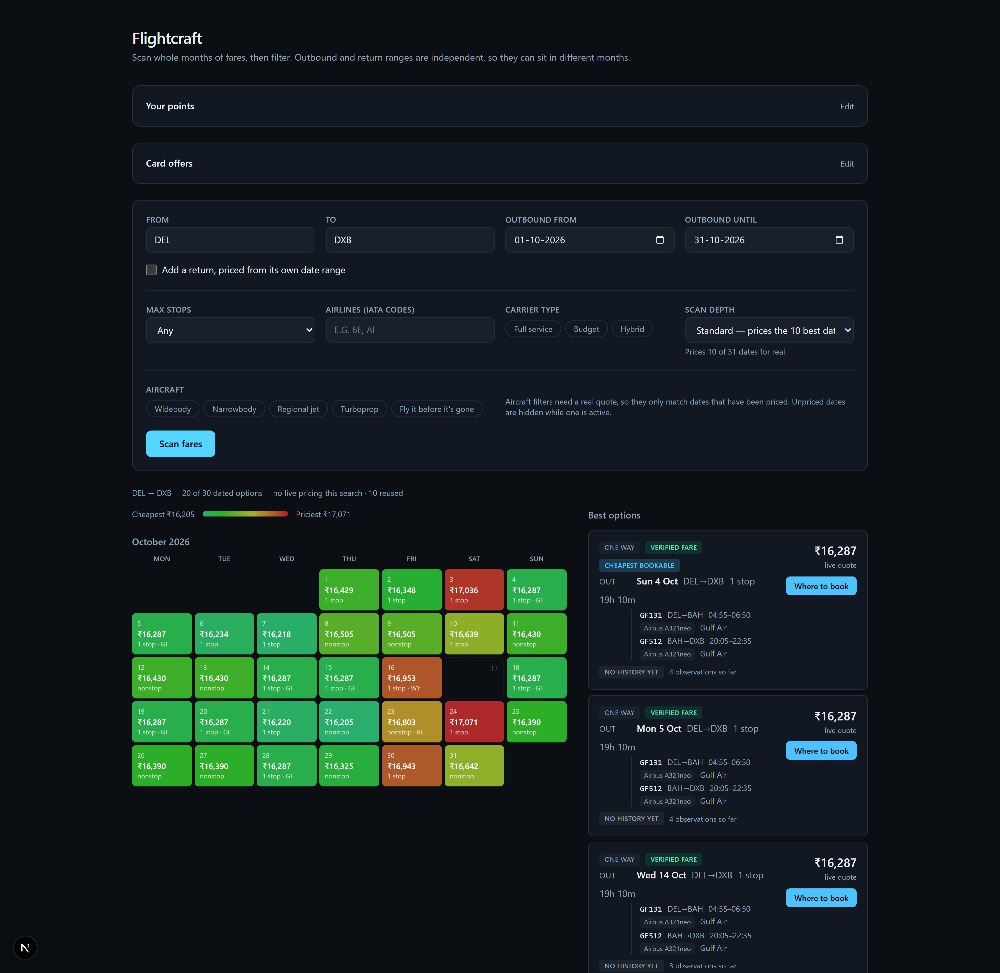
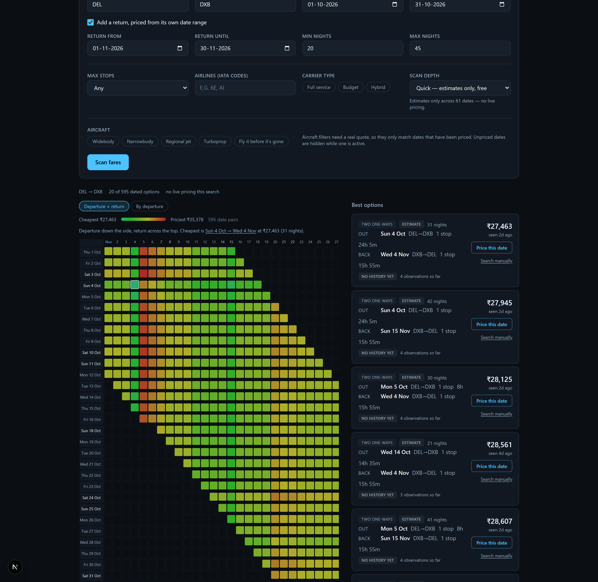
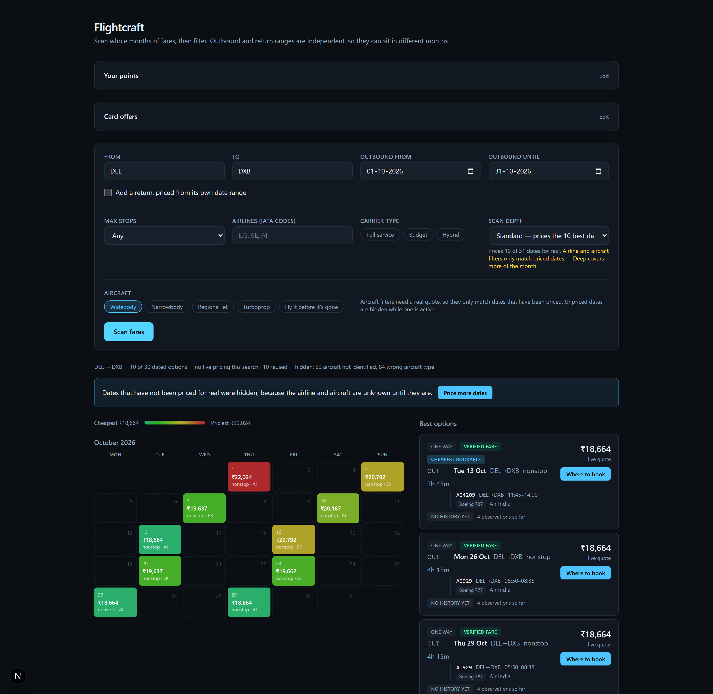

# Flightcraft

**Choose the flight. Then find the month.**

Say what you want to fly — nonstop, a widebody, a particular airline — and
Flightcraft scans whole months for the cheapest date that matches. Every other
search engine makes you commit to dates first and offers the aircraft as an
afterthought, if at all.



Skyscanner and Google Flights do offer a cheapest-in-a-month calendar, but you
cannot put constraints on it. Ask for *"the cheapest day in October, one stop
maximum, on a widebody, excluding budget carriers"* and you are back to
searching one date at a time.

Scanning a range and then filtering it is the core primitive here, so every
feature is the same pipeline with a different filter:

```
SearchSpec ──▶ FareScan ──▶ Enrich ──▶ Filter ──▶ Rank ──▶ Results
```

A single-date search is just a range of length one.

## Two months at once

Outbound and return ranges are independent. Fly out any day in October, come
back any day in November, bounded by trip length — and see the entire trade-off
surface rather than one row of it.



The shape is the point. That staircase is the 20-to-45-night constraint. The
green column down 4 November and the red one down the 5th say that on this route
the *return* date moves the price far more than the departure does — which is
invisible in a list, and invisible in a calendar of departure dates.

Booking the two legs as separate one-way tickets is frequently cheaper than any
single return fare. On a 62-night DEL–DXB trip it saved ₹6,954, and the app
says so outright.

## Filtering by aircraft

Aircraft type is a first-class filter: widebody, family, or *"fly it before it's
gone"* for the types most fleets are retiring.



Dates that have not been priced for real are hidden rather than guessed at,
because the aircraft is genuinely unknown until a live quote names it — and the
count of what was hidden is reported rather than silently dropped.

## What works today

- **Whole-month (or multi-month) fare scanning** with a price heatmap calendar.
- **Independent outbound and return ranges.** Fly out any day in October, come
  back any day in January, bounded by trip length. The two ranges are priced
  separately and paired afterwards, which is frequently cheaper than any single
  return fare — and is not expressible on any mainstream site.
- **Filters that survive the month scan**: max stops, specific airlines,
  carrier type (budget / full service / hybrid), alliance, price cap.
- **Aircraft filters** on real equipment — widebody, family, or "fly it before
  it's gone" for types most fleets are retiring.
- **Verified fares with the actual flights**: airline, flight number, aircraft,
  segment times, baggage, and every seller's own price.
- **Price history**, accumulating from every scan plus a daily sweep of ~24
  popular Indian routes. Each result is scored against what that departure date
  has cost before — good / typical / above usual, and an error-fare flag for
  anything far below its own median.
- **Points guidance** that values a redemption against the whole month of cash
  fares, not just the date it sits on.
- **Card offers** applied *before* ranking, because a discount changes which
  date is cheapest.

## Two stages, and why

Cached data is wide and free but anonymous; live quotes are exact but cost money
per date. Neither alone is the product, so the app uses both.

**Stage one — the free landscape.** Travelpayouts' cached fares map a whole year
in one call. Free with affiliate registration at
[travelpayouts.com](https://travelpayouts.com). It says what a date roughly
costs and nothing about who flies it.

**Stage two — real itineraries.** [Ignav](https://ignav.com) prices specific
dates live: marketing and operating carrier, flight number, aircraft, segment
times, cabin, baggage, and booking links with each seller's own price. 1,000
free requests, then $2 per 1,000 — about ₹2 a search.

The landscape decides where to spend. Every date the traveller asked about still
appears; the ones worth paying for become real offers and the rest stay labelled
estimates, priceable on demand for one request.

### Ranking: what you can pay beats what you cannot

Two rules that both cost real correctness if dropped:

1. **A verified fare outranks a cheaper estimate.** Cached prices are
   systematically optimistic — they are the fares that were cheapest at some
   point, and cheap ones vanish first. Ranking on price alone put five
   unbookable estimates at the top of the first live run.
2. **Offers are applied before ranking, not after.** With "3,000 off above
   16,500" on DEL-DXB, the 16,287 fare misses the threshold and the 16,803 one
   pays 13,803. The dearer ticket is the cheaper one.

### Scan depth is a cost dial

| Depth | Cached calls | Live requests | What you get |
|---|---|---|---|
| `quick` | 1 per direction | 0 | Estimates across a whole year, free |
| `standard` | + 1 per month per direction | up to 10 | The best dates priced for real |
| `deep` | same | up to 30 | Roughly a month priced for real |

An airline or aircraft filter changes the targeting: the cached ranking is a
poor guide to where *that* carrier is cheap, so the budget spreads evenly across
the window instead of piling onto the dates that merely look cheapest.

### What the live API actually does

Measured against the real service, not the docs — several things differ, and
each one changed the design:

- **Prices are city-level.** A search for `LHR` returns rows stamped `LON`.
  Comparing codes exactly made DEL–LHR look like a route with no fares at all;
  comparing *city* codes fixes it while still excluding the neighbouring-city
  fares the endpoint mixes in (a DXB search also returns Sharjah).
- **`calendar` ignores the month it is given.** October, December, or anything
  else returns the identical 26 rows spanning five months. It is not used.
- **One-way and round-trip fares are mixed together** in the same responses, and
  are not comparable. A one-way search must therefore discard round-trip fares
  rather than show a roughly doubled price.
- **Airline attribution is unavailable from the cached feed.** The only endpoint
  that names an airline prices round trips, refuses any trip longer than 30
  nights, and returns nothing for most date pairs — so it is not used at all.
  Attribution comes from stage two instead.

Filters that need an airline or an aircraft reject unattributed fares rather
than guess, and the count is reported separately so the UI can offer to price
more dates instead of silently showing less.

## Running it

```bash
python -m venv .venv
.venv/Scripts/python.exe -m pip install -r requirements-dev.txt
npm --prefix web install
```

Copy `.env.example` to `.env`. Without a `TRAVELPAYOUTS_TOKEN` the app starts in
**demo mode** with clearly-labelled synthetic fares, so you can use the whole
interface before registering.

```bash
.venv/Scripts/python.exe -m uvicorn api.main:app --reload --port 8000
npm --prefix web run dev
```

Then open http://localhost:3000.

```bash
.venv/Scripts/python.exe -m pytest
```

The README screenshots are regenerated with `scripts/screenshots.py`, which
needs a browser the test suite does not:

```bash
pip install playwright && playwright install chromium
python scripts/screenshots.py
```

## Layout

```
api/
  domain.py              canonical types: SearchSpec, DateRange, FareRow, TripOption
  providers/
    travelpayouts.py     stage one — cached fares, wide and free
    ignav.py             stage two — live itineraries with carrier and aircraft
    demo.py              deterministic synthetic fares for running without a token
  pipeline/
    scan.py              stage-one fan-out across the date space
    resolve.py           stage-two targeting: which cells are worth paying for
    filters.py           composable filters, and an account of what they removed
  engines/
    datespace.py         pairing independent date ranges into trip options
    history.py           price history, and the book-now-or-wait verdict
    points.py            valuing a redemption against the whole cash scan
    offers.py            card offers, and the re-ranking they cause
  reference/
    carriers.py          carrier class and alliance lookups
    aircraft.py          classifying "Airbus A321neo" into family and body type
    loyalty.py           which points can book which carrier
    places.py            airport-to-city resolution
  data/                  curated reference data, India-first
web/                     Next.js frontend
```

Four ordering rules in the pipeline are load-bearing and easy to get wrong.
Each one was a real bug before it was a rule:

- **Filter fares before pairing or collapsing them.** Options keep the cheapest
  fare per date, so filtering afterwards judges a date by a fare the traveller
  already excluded — a budget-only search on a day where Gulf Air is cheapest
  and IndiGo also flies would drop the day rather than offer the IndiGo seat.
- **Rank on the price you can actually pay**: a verified fare before a cheaper
  estimate, and after any card offer.
- **Measure the split-ticket saving before collapsing**, because collapsing
  deletes the round-trip ticket exactly when the split beats it.
- **Price is a trip-level filter**, never a per-leg one.

## Roadmap

### What is deliberately not in the data files

Award prices and bank transfer ratios are absent from `loyalty.yaml`, and no
card offers ship at all. All three change constantly, none is published
machine-readably, and the sources that carry them contradict each other. A
points transfer is irreversible and a stale offer means booking for a discount
that never arrives — so the traveller supplies the numbers they can read off
their own bank's page, and the app does arithmetic on figures that are correct
by construction. What the files *do* carry is structural and slow-moving: which
airline owns a programme, which alliance it books, which programmes pool a
currency.

### Ordered roughly by value per unit of effort

- **Aircraft filters** — exact type, family, or category (widebody, four-engine,
  "fly it before it's gone"), from a route→equipment database built via
  AeroDataBox and OpenSky. Labelled with confidence, since equipment swaps.
  Blocked on the attribution question above.
- **True-cost pricing** — baggage, seat and meal fees folded in, so a ₹4,000
  budget fare plus a checked bag can correctly lose to a ₹5,200 full-service one.
- **Layover intelligence** — connection times, terminal changes, self-transfer
  risk, and transit-visa checks for the Indian passport.
- **Booking curve** — median price by days-to-departure, so a route can say
  "fares here usually bottom out 45-60 days out; you are at 80". The
  observations are already being recorded for it; the analysis is not built.
- **Miles and points** — the emphasis is airline and alliance redemptions, not
  card points. For one flight the engine compares every program the traveller
  holds (own-airline, alliance partner, non-alliance bilateral, or via a card
  transfer) and says which to spend — and when not to redeem at all. Award seat
  availability cannot be checked by any free API, so the UI must always say "if a
  saver seat is available" and link out to the program's own search.
- **Discovery** — "anywhere under ₹15,000 in December", crossed with visa data
  for visa-free destinations, plus a holiday-aware calendar that spots
  long-weekend arbitrage.

## Scope

Search, filtering and insight. There is no booking or payment flow: results
hand off to the airline or OTA. We do not scrape Skyscanner or Google Flights.
